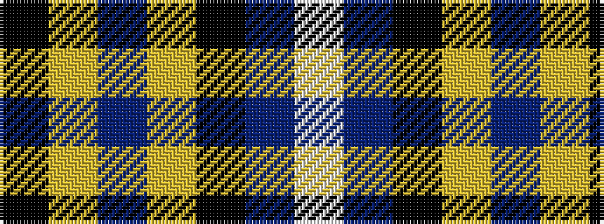

KYBYKBW

It is a 7 stripe tartan.

<figure class="pat-woven">

<figcaption>idealised sample</figcaption>
</figure>

## Colour Sequence



## Tartans with this colour sequence

| Tartans |
|---------------|
| [Grahame Laurie Band (Corporate)](/setts/s7/k8ly2dp6ly2k36db84w7/)|
||
