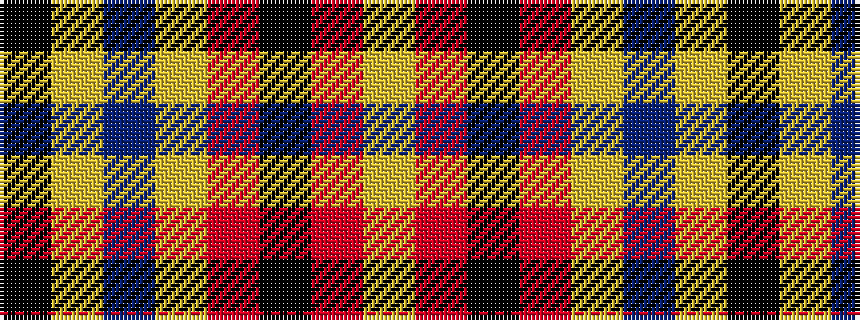

KYBYRKRY

It is a 8 stripe tartan.

<figure class="pat-woven">

<figcaption>idealised sample</figcaption>
</figure>

## Colour Sequence



## Tartans with this colour sequence

| Tartans |
|---------------|
| [Lermontov Bicentenary](/setts/s8/lo5r6k5r6lo36b3lo2k1~x2/)|
||
| [Lermontov Bicentenary](/setts/s8/lo5r6k5r6lo36db3lo2k1~x2/)|
||
