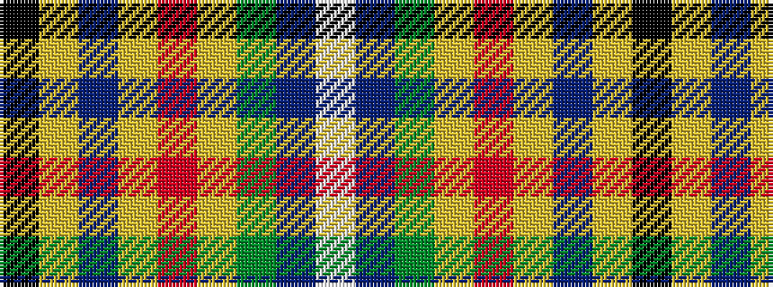

KYBYRYGBW

It is a 9 stripe tartan.

<figure class="pat-woven">

<figcaption>idealised sample</figcaption>
</figure>

## Colour Sequence



## Tartans with this colour sequence

| Tartans |
|---------------|
| [Coats (New Zealand)](/variants/s9/k9ly6db9lr2o3lr2dg17db17lb5~x2/)|
||
