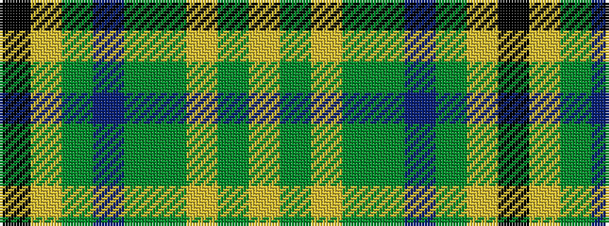

KYGBGGYGY

It is a 9 stripe tartan.

<figure class="pat-woven">

<figcaption>idealised sample</figcaption>
</figure>

## Colour Sequence



## Tartans with this colour sequence

| Tartans |
|---------------|
| [Corcoran of Sherbrooke (Personal)](/variants/s9/k1lr1g5dp1g2dy5lr1y3lr1~x4/)|
||
