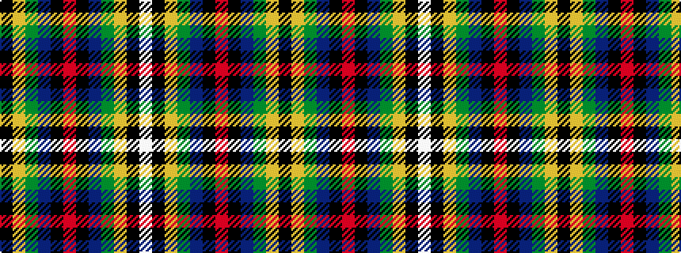

KYGBKRKBGYKW

It is a 12 stripe tartan.

<figure class="pat-woven">

<figcaption>idealised sample</figcaption>
</figure>

## Colour Sequence



## Tartans with this colour sequence

| Tartans |
|---------------|
| [Cornish Hunting](/variants/s12/k26ly2dg24db8k4r3k4db8dg24ly2k26w5~x2/)|
||
