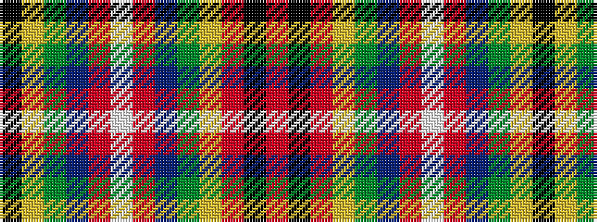

KYGBRWRBGYRKR

It is a 13 stripe tartan.

<figure class="pat-woven">

<figcaption>idealised sample</figcaption>
</figure>

## Colour Sequence



## Tartans with this colour sequence

| Tartans |
|---------------|
| [Day (2016)](/variants/s13/r60k1r2ly1dg6db6r2lb3r2db6dg6ly1k5~x2/)|
||
