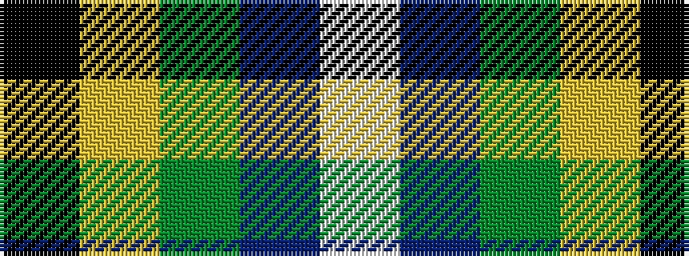

KYGBW

It is a 5 stripe tartan.

<figure class="pat-woven">

<figcaption>idealised sample</figcaption>
</figure>

## Colour Sequence



## Tartans with this colour sequence

| Tartans |
|---------------|
| [Turnbull Hunting (1983) #2](/variants/s5/k2ly1g10db10w1~x6/)|
||
| [Turnbull, hunting](/variants/s5/k7ly3g28db28w3~x2/)|
||
