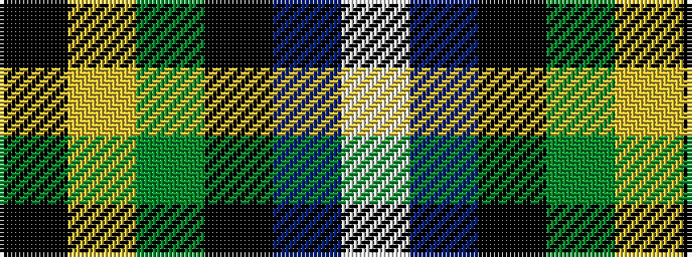

KYGKBW

It is a 6 stripe tartan.

<figure class="pat-woven">

<figcaption>idealised sample</figcaption>
</figure>

## Colour Sequence



## Tartans with this colour sequence

| Tartans |
|---------------|
| [Dyce](/setts/s6/k2ly1g6k6db6w1~x4/)|
||
| [Dyce #3](/setts/s6/k2ly1dg6k6db6w1~x4/)|
||
