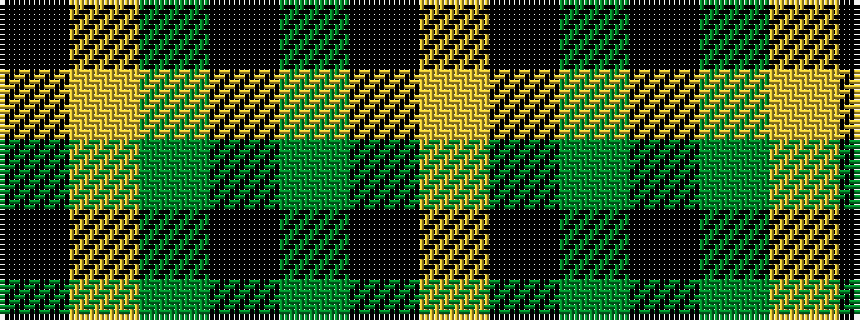

KYGKGKY

It is a 7 stripe tartan.

<figure class="pat-woven">

<figcaption>idealised sample</figcaption>
</figure>

## Colour Sequence



## Tartans with this colour sequence

| Tartans |
|---------------|
| [Green Rover (Personal)](/setts/s7/lo10k2g5k2dg46lo2k2~x2/)|
||
