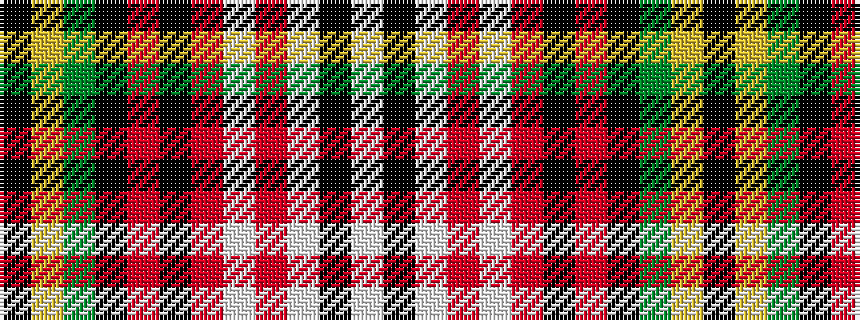

KYGKRKRWRWKW

It is a 12 stripe tartan.

<figure class="pat-woven">

<figcaption>idealised sample</figcaption>
</figure>

## Colour Sequence



## Tartans with this colour sequence

| Tartans |
|---------------|
| [Watson-Kirby (Personal)](/variants/s12/k5ly3dg10k23r3k10r3w2r9w2k3w1~x2/)|
||
