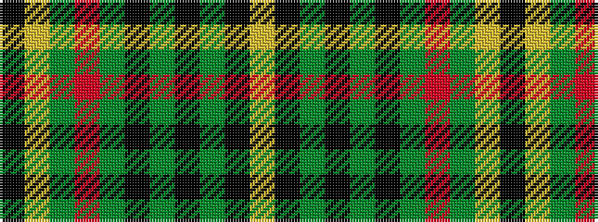

KYGRGKGKGKY

It is a 11 stripe tartan.

<figure class="pat-woven">

<figcaption>idealised sample</figcaption>
</figure>

## Colour Sequence



## Tartans with this colour sequence

| Tartans |
|---------------|
| [MacMillan Anc (Clans Originaux)](/setts/s11/ly10k2g3k2g40k2g3r25g6ly10k1~x2/)|
||
