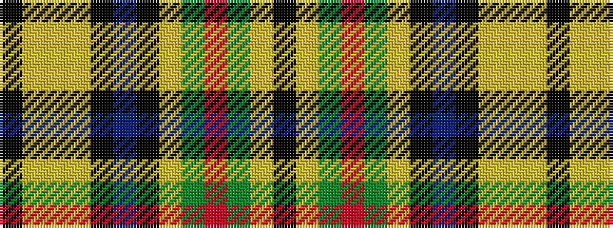

KYGRGYKBKYYYK

It is a 13 stripe tartan.

<figure class="pat-woven">

<figcaption>idealised sample</figcaption>
</figure>

## Colour Sequence



## Tartans with this colour sequence

| Tartans |
|---------------|
| [Liberton](/setts/s13/k5lr5ly2lr5k5dt25k5lr3dg5r2dg5lr3k5~x2/)|
||
