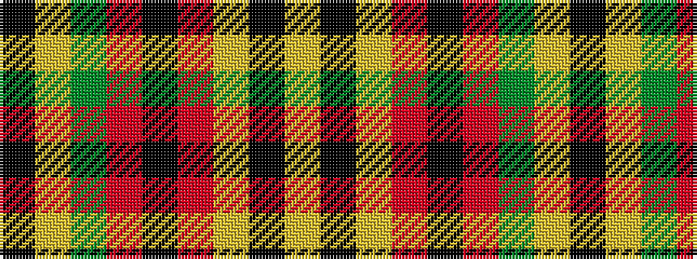

KYGRKRYKY

It is a 9 stripe tartan.

<figure class="pat-woven">

<figcaption>idealised sample</figcaption>
</figure>

## Colour Sequence



## Tartans with this colour sequence

| Tartans |
|---------------|
| [Brooks Brothers Signature (Corporate](/setts/s9/k5lo1dg7r1k45r5lo3k4lo3~x2/)|
||
