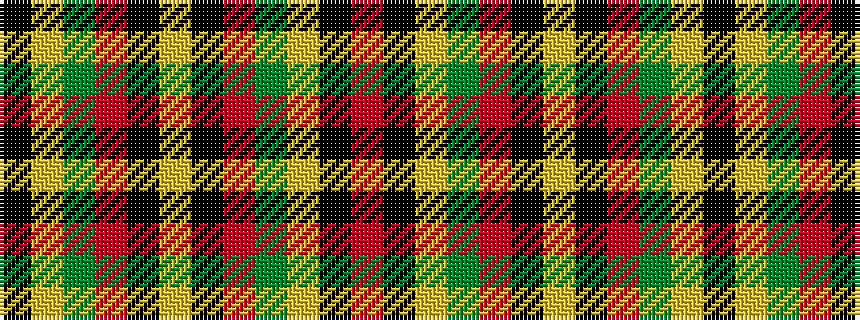

KYGRKYKRGYKR

It is a 12 stripe tartan.

<figure class="pat-woven">

<figcaption>idealised sample</figcaption>
</figure>

## Colour Sequence



## Tartans with this colour sequence

| Tartans |
|---------------|
| [Scrimgeour of Glassary](/setts/s12/r32k3lo6g10r6k3lo32~x2/)|
||
| [Scrymgeour](/setts/s12/r15k1lo2g3r2k1lo15~x6/)|
||
