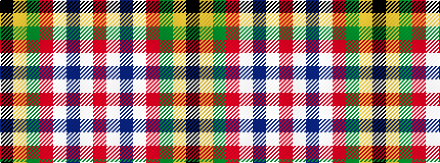

KYGRWBWR

It is a 8 stripe tartan.

<figure class="pat-woven">

<figcaption>idealised sample</figcaption>
</figure>

## Colour Sequence



## Tartans with this colour sequence

| Tartans |
|---------------|
| [Legion of Frontiersmen (Corporate)](/variants/s8/k45lo10g7r3w4db13w9r6~x2/)|
||
