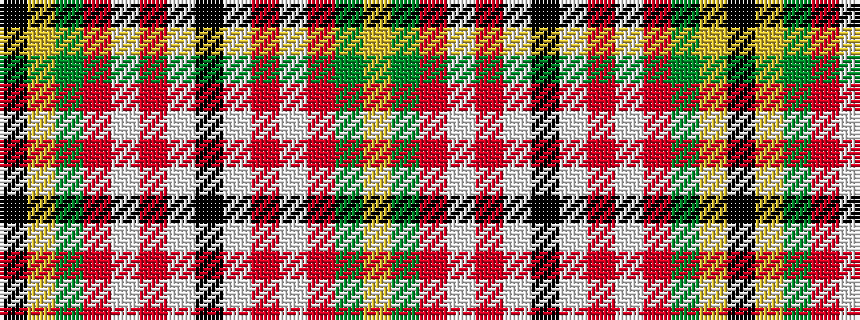

KYGRWRWKWRWRGY

It is a 14 stripe tartan.

<figure class="pat-woven">

<figcaption>idealised sample</figcaption>
</figure>

## Colour Sequence



## Tartans with this colour sequence

| Tartans |
|---------------|
| [Norwich No.005](/setts/s14/k10ly2dg11r11w1r1w1k9~x4/)|
||
