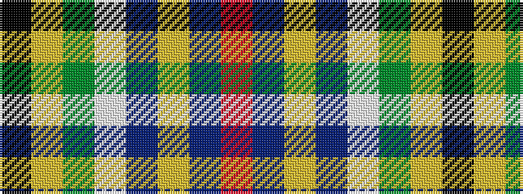

KYGWBYBR

It is a 8 stripe tartan.

<figure class="pat-woven">

<figcaption>idealised sample</figcaption>
</figure>

## Colour Sequence



## Tartans with this colour sequence

| Tartans |
|---------------|
| [Royal Yacht Britannia](/setts/s8/k43ly3dg1w1db1ly3db25r2~x2/)|
||
