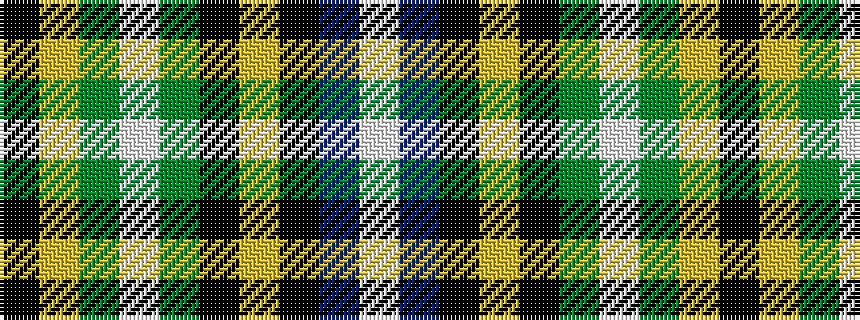

KYGWGKYKBW

It is a 10 stripe tartan.

<figure class="pat-woven">

<figcaption>idealised sample</figcaption>
</figure>

## Colour Sequence



## Tartans with this colour sequence

| Tartans |
|---------------|
| [Corstorphine Trial A](/setts/s10/k6ly2g18w3g13k3ly4k3db18w3~x2/)|
||
