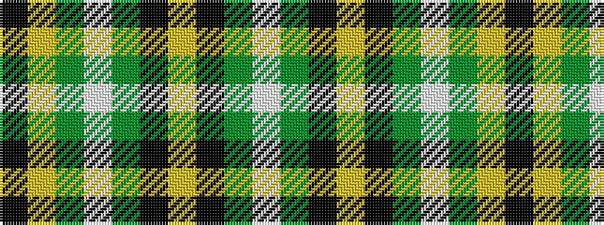

KYGWGKYKGW

It is a 10 stripe tartan.

<figure class="pat-woven">

<figcaption>idealised sample</figcaption>
</figure>

## Colour Sequence



## Tartans with this colour sequence

| Tartans |
|---------------|
| [Forrester / Foster, hunting](/setts/s10/k3ly2g18w3g18k3ly4k3gi18w3~x2/)|
||
| [Forrester Hunting Clan Tartan Tartan Number: 2385. Earliest known date: 1997 A clan society that has been in existence since the 1980's. This hunting tartan was fully adopted in 1997. Can be worn with anyone with the name. Note from EBW "From the book "The Forresters" by Colin D.I.G.Forrester, 1988" See products available Copyright © Blair Urquhart, Comrie, 2015](/setts/s10/k3ly2gi18w3gi18k3ly4k3g18w3~x2/)|
||
| [Forrester/Foster Hunting](/setts/s10/k3ly2gi18w3gi13k3ly4k3g18w3~x2/)|
||
