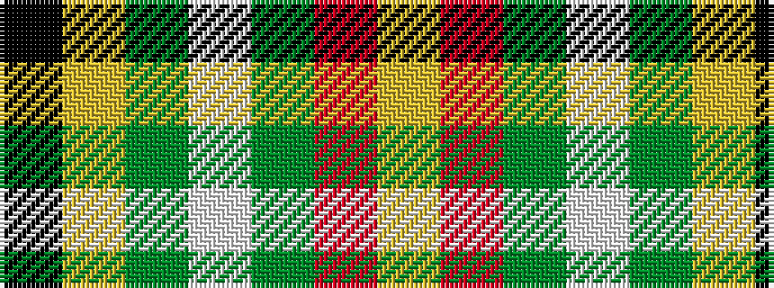

KYGWGRY

It is a 7 stripe tartan.

<figure class="pat-woven">

<figcaption>idealised sample</figcaption>
</figure>

## Colour Sequence



## Tartans with this colour sequence

| Tartans |
|---------------|
| [Red Rum Commemorative Tartan](/variants/s7/k2ly30g4w2g14r13ly2~x2/)|
||
