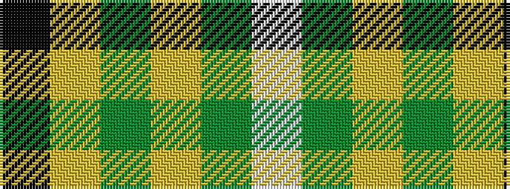

KYGYGW

It is a 6 stripe tartan.

<figure class="pat-woven">

<figcaption>idealised sample</figcaption>
</figure>

## Colour Sequence



## Tartans with this colour sequence

| Tartans |
|---------------|
| [Shepherd, Derek (Piping)](/setts/s6/k5ly2dy7ly18dy2w2~x4/)|
||
