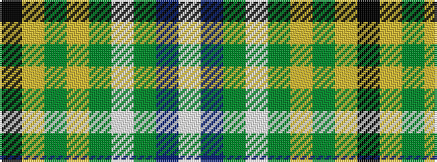

KYGYGWGBW

It is a 9 stripe tartan.

<figure class="pat-woven">

<figcaption>idealised sample</figcaption>
</figure>

## Colour Sequence



## Tartans with this colour sequence

| Tartans |
|---------------|
| [McClurg](/setts/s9/k4ly1g2ly1g32lt1g3db32lt3~x2/)|
||
