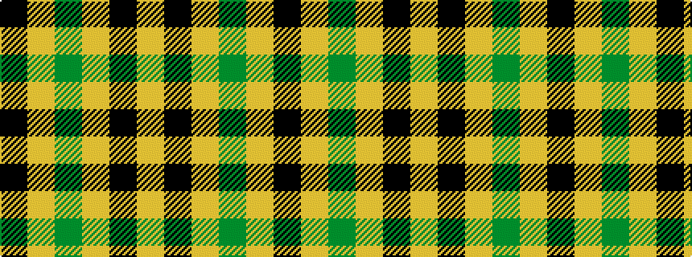

KYGYKY

It is a 6 stripe tartan.

<figure class="pat-woven">

<figcaption>idealised sample</figcaption>
</figure>

## Colour Sequence



## Tartans with this colour sequence

| Tartans |
|---------------|
| [Volkswagen Orange Trim (Fashion)](/variants/s6/lo26k10lo3g3lo3k3~x6/)|
||
