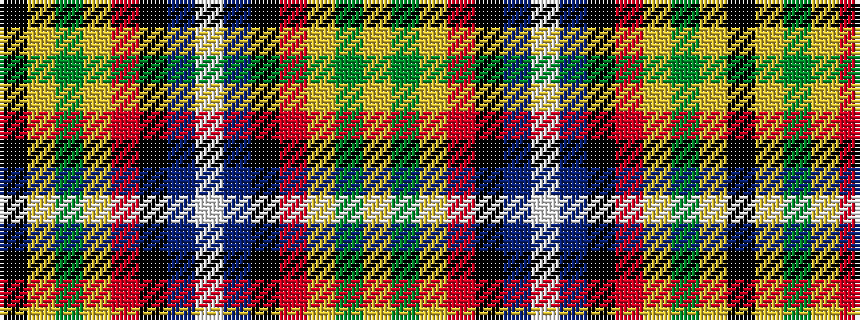

KYGYRKBWBKRYGY

It is a 14 stripe tartan.

<figure class="pat-woven">

<figcaption>idealised sample</figcaption>
</figure>

## Colour Sequence



## Tartans with this colour sequence

| Tartans |
|---------------|
| [Lambert Hunting (Personal)](/setts/s14/lo34g10lo5r2k8b2w3b2k8r2lo5g10lo28k3~x2/)|
||
