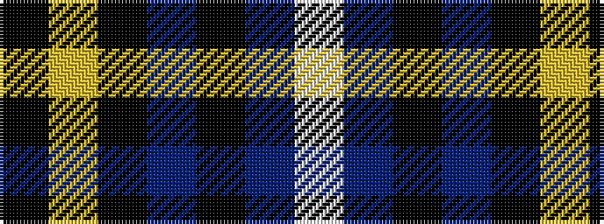

KYKBKBW

It is a 7 stripe tartan.

<figure class="pat-woven">

<figcaption>idealised sample</figcaption>
</figure>

## Colour Sequence



## Tartans with this colour sequence

| Tartans |
|---------------|
| [Pride of Nova Scotia (Corporate)](/setts/s7/k3lo2k36dt16k5dt2w3~x2/)|
||
