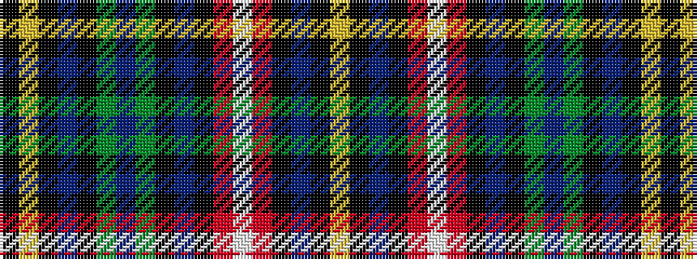

KYKBKGBGKBKRWRKBKY

It is a 18 stripe tartan.

<figure class="pat-woven">

<figcaption>idealised sample</figcaption>
</figure>

## Colour Sequence



## Tartans with this colour sequence

| Tartans |
|---------------|
| [Buchanan](/variants/s18/ly6k1db4k1r8lb1r8k1db4k1dg6db4dg6k1db4k1ly6k1~x2/)|
||
