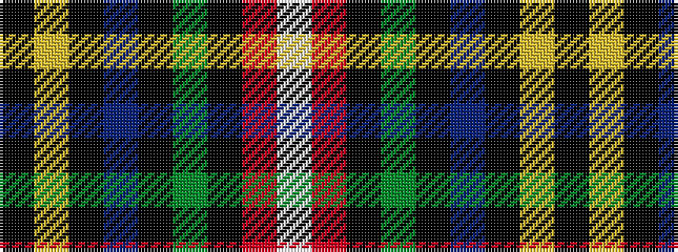

KYKBKGKRW

It is a 9 stripe tartan.

<figure class="pat-woven">

<figcaption>idealised sample</figcaption>
</figure>

## Colour Sequence



## Tartans with this colour sequence

| Tartans |
|---------------|
| [McCuaig (2010) (Name)](/setts/s9/k10ly3k2b20k10g15k2r3w3~x2/)|
||
| [McCuaig (Glenelg and the Western Isles)](/setts/s9/k10ly3k2db20k10g15k2r3w3~x2/)|
||
