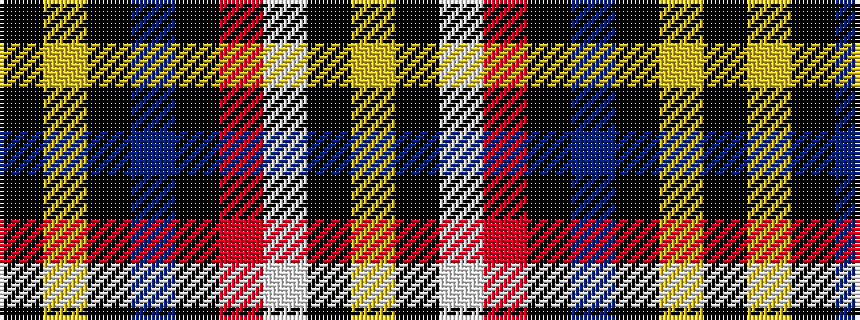

KYKBKRWKY

It is a 9 stripe tartan.

<figure class="pat-woven">

<figcaption>idealised sample</figcaption>
</figure>

## Colour Sequence



## Tartans with this colour sequence

| Tartans |
|---------------|
| [Care Leaver](/setts/s9/lg15k50w4m18k5b5k15ly10k4~x2/)|
||
