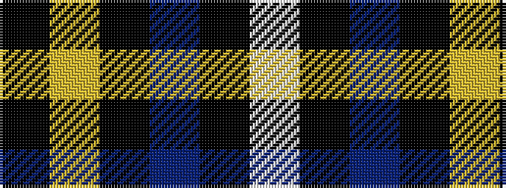

KYKBKW

It is a 6 stripe tartan.

<figure class="pat-woven">

<figcaption>idealised sample</figcaption>
</figure>

## Colour Sequence



## Tartans with this colour sequence

| Tartans |
|---------------|
| [Jon's Theme](/variants/s6/k1ly2k3n12k18w1~x2/)|
||
| [Jon's Theme (Fashion)](/variants/s6/k1lo2k3db12k18w1~x2/)|
||
