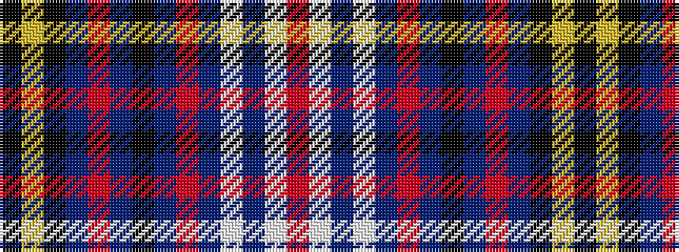

KYKBRBKBRBWBWR

It is a 14 stripe tartan.

<figure class="pat-woven">

<figcaption>idealised sample</figcaption>
</figure>

## Colour Sequence



## Tartans with this colour sequence

| Tartans |
|---------------|
| [Scottish Wildcat](/setts/s14/o10w2do1w2n10o8do2k17do2o7n19k3ly1k1~x2/)|
||
