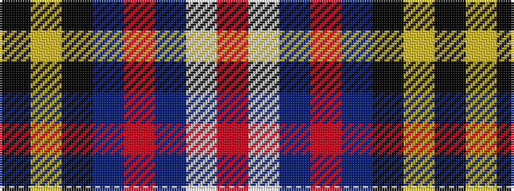

KYKBRBWR

It is a 8 stripe tartan.

<figure class="pat-woven">

<figcaption>idealised sample</figcaption>
</figure>

## Colour Sequence



## Tartans with this colour sequence

| Tartans |
|---------------|
| [Sullivan of Braemar](/variants/s8/k8ly4k16db10r19db10w2r6~x2/)|
||
