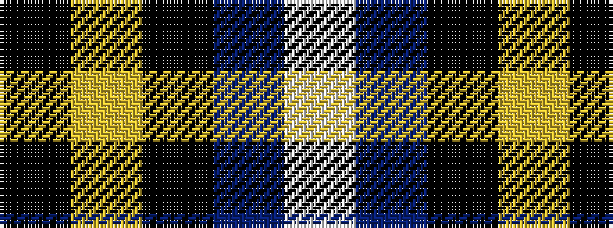

KYKBW

It is a 5 stripe tartan.

<figure class="pat-woven">

<figcaption>idealised sample</figcaption>
</figure>

## Colour Sequence



## Tartans with this colour sequence

| Tartans |
|---------------|
| [College of Radiographers](/variants/s5/k15lo2k10db18lb3~x2/)|
||
| [College of Radiographers Corporate Tartan](/variants/s5/k15ly2k10db18w3~x2/)|
||
