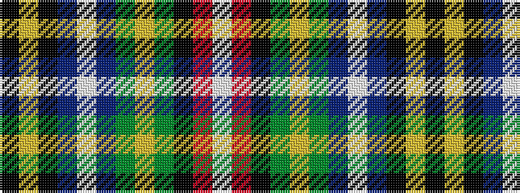

KYKBWBGYGKRW

It is a 12 stripe tartan.

<figure class="pat-woven">

<figcaption>idealised sample</figcaption>
</figure>

## Colour Sequence



## Tartans with this colour sequence

| Tartans |
|---------------|
| [State Seal of Maryland (Fashion)](/setts/s12/k3lo3k2b40lb3b10g10lo3g21k1r3lb3~x2/)|
||
