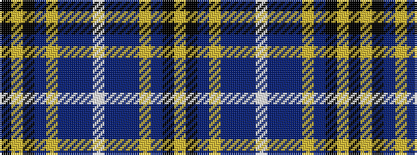

KYKBYBBBWBBBYBKY

It is a 16 stripe tartan.

<figure class="pat-woven">

<figcaption>idealised sample</figcaption>
</figure>

## Colour Sequence



## Tartans with this colour sequence

| Tartans |
|---------------|
| [Heirloom Dark Alba](/variants/s16/k4lo2k34db10lr4db4dp4db23w3~x2/)|
||
