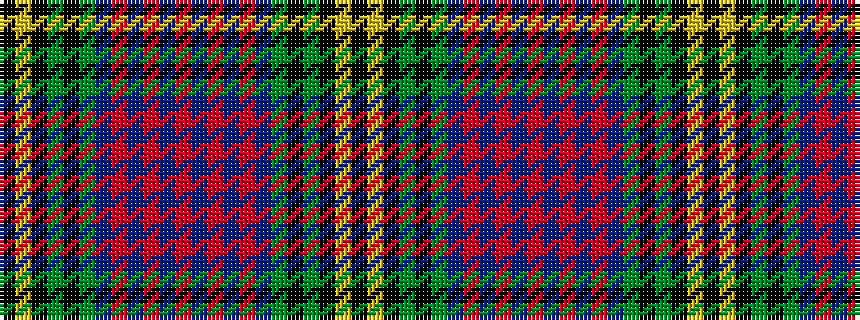

KYKGKGBRBRBRBRBRBGKGKYK

It is a 23 stripe tartan.

<figure class="pat-woven">

<figcaption>idealised sample</figcaption>
</figure>

## Colour Sequence



## Tartans with this colour sequence

| Tartans |
|---------------|
| [Wood (Clan)](/variants/s23/k3lr2k6g3k3g21db18r1db2r1db2r3db2r1db2r1db18g21k3g3k6ly2k3~x2/)|
||
| [Wood Clan/Family Tartan](/variants/s23/k3lr2k6g3k3g21db18r2db2r2db2r3db2r2db2r2db18g21k3g3k6ly2k3~x2/)|
||
