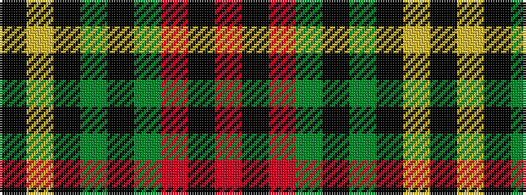

KYKGKGRKR

It is a 9 stripe tartan.

<figure class="pat-woven">

<figcaption>idealised sample</figcaption>
</figure>

## Colour Sequence



## Tartans with this colour sequence

| Tartans |
|---------------|
| [MacMillan Society of Glasgow](/variants/s9/r16k3r16g44k3g8k3ly20k4~x2/)|
||
