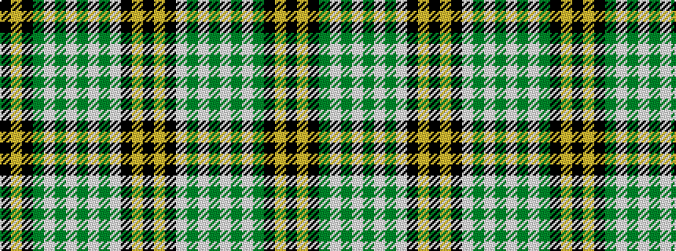

KYKGWGWGWGWKYK

It is a 14 stripe tartan.

<figure class="pat-woven">

<figcaption>idealised sample</figcaption>
</figure>

## Colour Sequence



## Tartans with this colour sequence

| Tartans |
|---------------|
| [Hammaby,The](/variants/s14/k1ly2k21w2g2w2g2w2g2w2g20k1ly2k1~x2/)|
||
| [Hammarby Football Club](/variants/s14/k1lo2k18lb2g2lb2g2lb2g2lb2g22k1lo2k1~x2/)|
||
