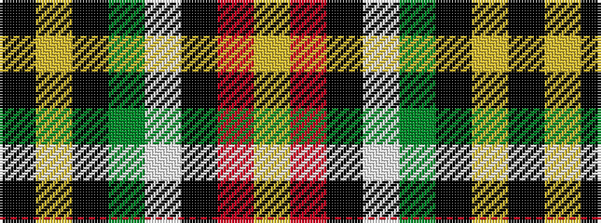

KYKGWKRY

It is a 8 stripe tartan.

<figure class="pat-woven">

<figcaption>idealised sample</figcaption>
</figure>

## Colour Sequence



## Tartans with this colour sequence

| Tartans |
|---------------|
| [Kilkenny County Crest (Fashion)](/variants/s8/lo6r8k4w6y16k13lr19k5~x2/)|
||
