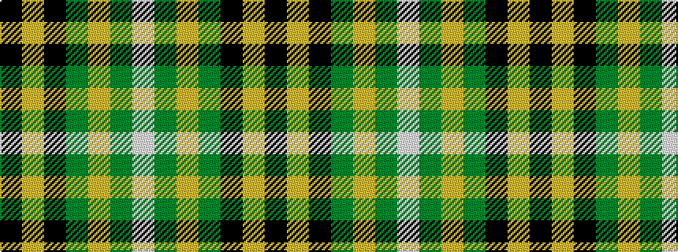

KYKGYGW

It is a 7 stripe tartan.

<figure class="pat-woven">

<figcaption>idealised sample</figcaption>
</figure>

## Colour Sequence



## Tartans with this colour sequence

| Tartans |
|---------------|
| [Ramsay (Orange)](/variants/s7/k4lo9k13g6lo3g9w4~x2/)|
||
