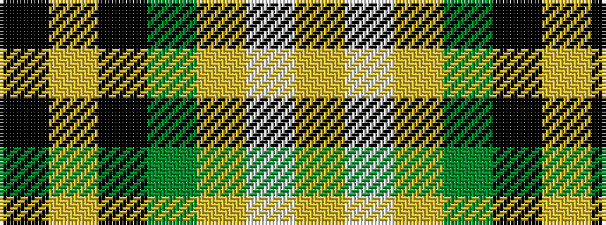

KYKGYWY

It is a 7 stripe tartan.

<figure class="pat-woven">

<figcaption>idealised sample</figcaption>
</figure>

## Colour Sequence



## Tartans with this colour sequence

| Tartans |
|---------------|
| [St Andrews Bay](/setts/s7/lo30w4lo20g20k20lo3k6~x2/)|
||
