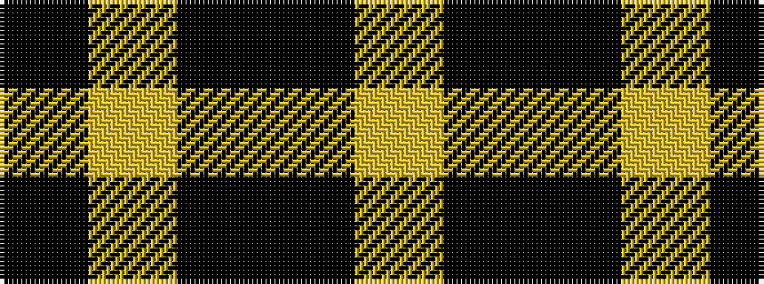

KYKKY

It is a 5 stripe tartan.

<figure class="pat-woven">

<figcaption>idealised sample</figcaption>
</figure>

## Colour Sequence



## Tartans with this colour sequence

| Tartans |
|---------------|
| [Perry Ancient (Personal)](/setts/s5/ly75k26k3ly4k6~x2/)|
||
