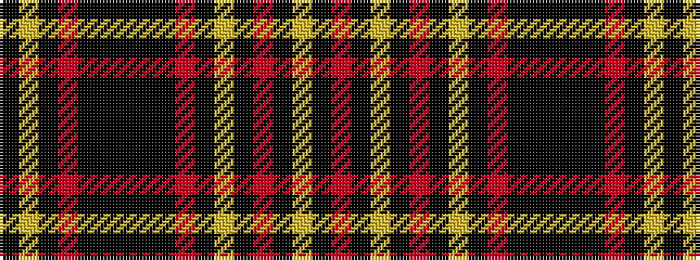

KYKRKKKKKRKYKRKYKR

It is a 18 stripe tartan.

<figure class="pat-woven">

<figcaption>idealised sample</figcaption>
</figure>

## Colour Sequence



## Tartans with this colour sequence

| Tartans |
|---------------|
| [City of New Bern 300 (District)](/variants/s18/r12ki2ly2ki2r2ki2ly2ki2r12ki1k2k3k2ki1r12ki2ly2ki2~x2/)|
||
