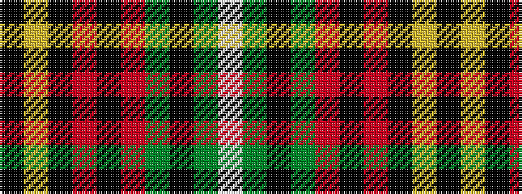

KYKRKRGKGW

It is a 10 stripe tartan.

<figure class="pat-woven">

<figcaption>idealised sample</figcaption>
</figure>

## Colour Sequence



## Tartans with this colour sequence

| Tartans |
|---------------|
| [Carlow County Crest (Fashion)](/setts/s10/w15g8k12g14r64k12r16k10ly8k14/)|
||
