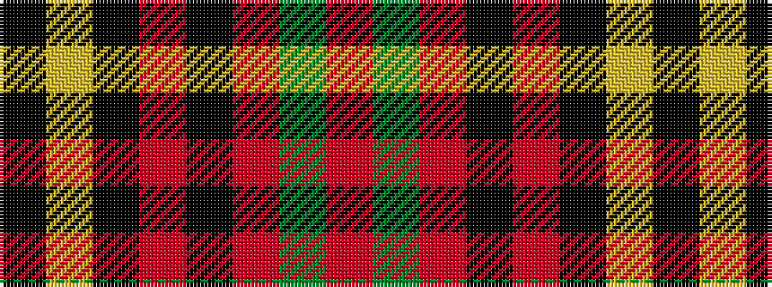

KYKRKRGR

It is a 8 stripe tartan.

<figure class="pat-woven">

<figcaption>idealised sample</figcaption>
</figure>

## Colour Sequence



## Tartans with this colour sequence

| Tartans |
|---------------|
| [Davis](/setts/s8/k3ly2k3r8k8r8dg2r3~x4/)|
||
