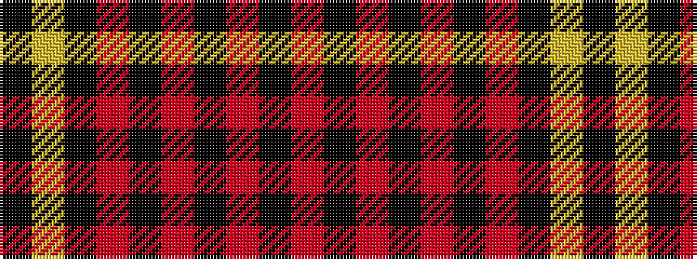

KYKRKRKRKR

It is a 10 stripe tartan.

<figure class="pat-woven">

<figcaption>idealised sample</figcaption>
</figure>

## Colour Sequence



## Tartans with this colour sequence

| Tartans |
|---------------|
| [Maier (Personal)](/setts/s10/r7k3r3k22r3k3r3k37ly2k4~x2/)|
||
