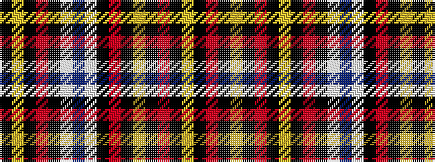

KYKRKWBWKRKYKRKYKR

It is a 18 stripe tartan.

<figure class="pat-woven">

<figcaption>idealised sample</figcaption>
</figure>

## Colour Sequence



## Tartans with this colour sequence

| Tartans |
|---------------|
| [City of New Bern 300](/setts/s18/o12k2ly2k2o2k2ly2k2o12k1w2db3w2k1o12k2ly2k2~x2/)|
||
