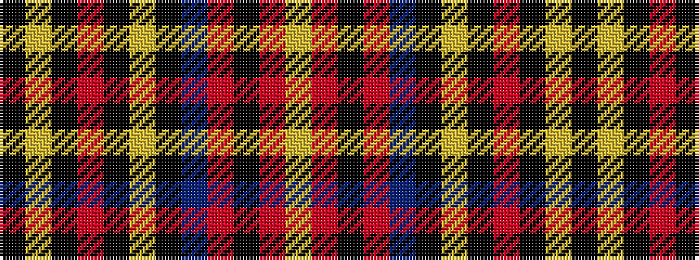

KYKRKYKBRKRY

It is a 12 stripe tartan.

<figure class="pat-woven">

<figcaption>idealised sample</figcaption>
</figure>

## Colour Sequence



## Tartans with this colour sequence

| Tartans |
|---------------|
| [Wcwm 849-3](/setts/s12/ki42lg3ki6m2ki2lr2ki2do10o6k2o4lr2~x2/)|
||
