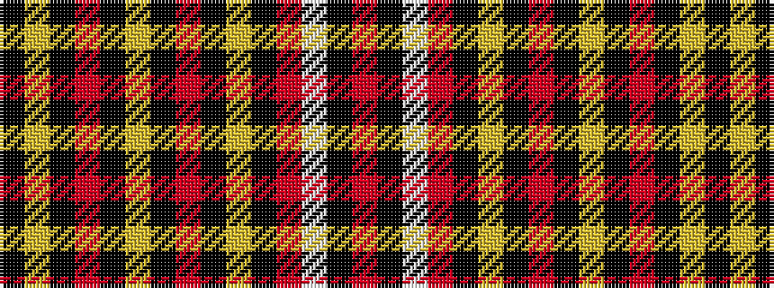

KYKRKYKRKYKRWKR

It is a 15 stripe tartan.

<figure class="pat-woven">

<figcaption>idealised sample</figcaption>
</figure>

## Colour Sequence



## Tartans with this colour sequence

| Tartans |
|---------------|
| [Black Onyx](/setts/s15/k30lr33k1o1k1lr8k1o2k1lr3k1o3w2k1o7~x2/)|
||
