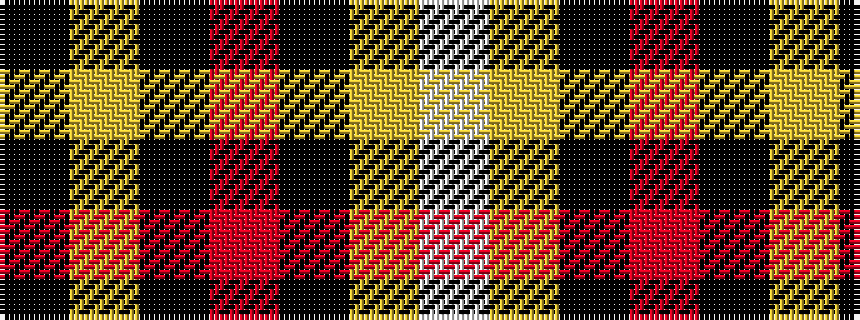

KYKRKYW

It is a 7 stripe tartan.

<figure class="pat-woven">

<figcaption>idealised sample</figcaption>
</figure>

## Colour Sequence



## Tartans with this colour sequence

| Tartans |
|---------------|
| [Richmond de Ellel (Personal)](/setts/s7/k5lo25k10r3k10lo25w5~x2/)|
||
