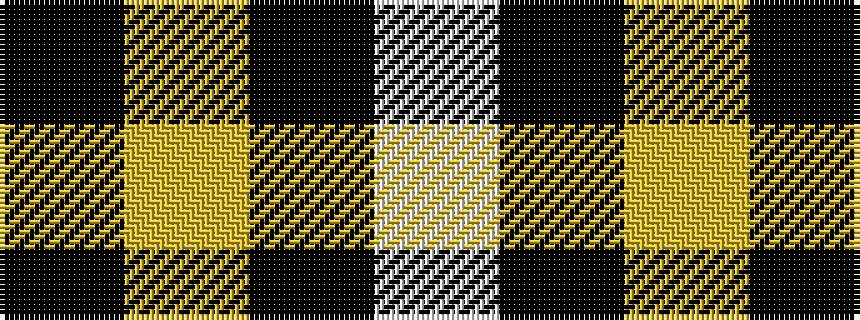

KYKW

It is a 4 stripe tartan.

<figure class="pat-woven">

<figcaption>idealised sample</figcaption>
</figure>

## Colour Sequence



## Tartans with this colour sequence

| Tartans |
|---------------|
| [Takla Makan #2 (Artefact)](/variants/s4/k4lo15k4w2~x2/)|
||
